# Gentool Data Viewer

A full-stack viewer and collector for GenTool replay data with Discord OAuth2 authentication.

## What is included

- Kotlin and Spring Boot 4 backend with session authentication and CSRF protection
- Next.js TypeScript frontend with backend calls proxied through Next.js API routes
- Discord OAuth2 production and WireMock-backed local login profiles
- PostgreSQL, H2, Flyway, health endpoints, and Docker Compose deployment templates

## Discord application review

The public legal documents required for the Discord application are available without authentication:

- Privacy Policy: `https://gentool-data-viewer.taonity.org/privacy`
- Terms of Service: `https://gentool-data-viewer.taonity.org/terms`

Enter these URLs in the Discord Developer Portal under the application's **General Information** page. Before requesting review, verify that both production URLs return `200`, keep the application description and requested `identify` scope accurate, and ensure `taonity.org@gmail.com` remains a monitored support, privacy, and data-deletion channel. Update the documents whenever collected data, Discord scopes, providers, retention, or user-facing functionality changes.

## Prerequisites

- Java 17
- Maven
- Node.js 24 and npm
- Docker and Docker Compose (optional)

## Profiles

Choose one profile from each resource group.

| Resource | Local/stub | Production |
|---|---|---|
| Database | `h2` | `postgres` |
| OAuth2 | `stub-discord` | `prod-discord` |
| Logging | `plain-log` (included by `local`) | default |
| General | `local` | none |

Local development uses `h2,stub-discord,local`. Stage and production use only `stage` or `prod`; each environment profile includes `postgres` and `prod-discord` and owns its non-secret deployment settings. Add the optional `demo-data` profile to seed local feature fixtures, including 50 anonymized replays and 15 fictional players with CPU ratings.

## Self-service rescans

Authenticated VIEWER users claim or replace their linked GenTool identity directly from a Players row; no admin approval is required. Players rows provide targeted refresh actions, and Replays rows can refresh that replay reporter. The linked player does not consume the daily count quota; other-player refreshes are limited to 20 per UTC day. All refreshes use the same serial, throttled collector queue, scan the configured seven-day lookback, enforce a five-minute per-target cooldown, and are recorded in the rescan ledger and audit log.

## Run locally

Run each command from the repository root.

Start the backend:

```bash
mvn -pl backend spring-boot:run '-Dspring-boot.run.jvmArguments="-Dspring.profiles.active=h2,stub-discord,local"'
```

Start the backend with pending access requests, audit records, and anonymized replay/player fixtures:

```bash
mvn -pl backend spring-boot:run '-Dspring-boot.run.jvmArguments="-Dspring.profiles.active=h2,stub-discord,local,demo-data"'
```

Start the frontend in another terminal:

```bash
npm install --prefix frontend; npm run dev --prefix frontend
```

The backend runs on `http://127.0.0.1:8080`; the frontend runs on `http://127.0.0.1:3000`.

Build the backend container image from the repository root:

```bash
mvn clean install -P build-docker-image -DskipTests
```

Build the frontend container image from the repository root:

```bash
docker build -t generaltao725/gentool-data-viewer-frontend:latest frontend
```

For the complete local stack with published images:

```bash
docker compose --env-file templates/docker/.env.test -f templates/docker/docker-compose.yml -f templates/docker/docker-compose.ports-local.yml up
```

See [Deployment](docs/DEPLOYMENT.md) for production configuration and Compose requirements. See [Database](docs/DATABASE.md) for schema and migration management.

## Database Schema

```mermaid
erDiagram
    app_user {
        character_varying access_status "{NOT_NULL}"
        character_varying auth_provider "{NOT_NULL}"
        character_varying display_name "{NOT_NULL}"
        character_varying picture_url 
        character_varying requested_role 
        character_varying role "{NOT_NULL}"
        character_varying user_id PK "{NOT_NULL}"
    }

    audit_log {
        character_varying action "{NOT_NULL}"
        character_varying actor_user_id "{NOT_NULL}"
        character_varying id PK "{NOT_NULL}"
        timestamp_without_time_zone occurred_at "{NOT_NULL}"
        character_varying target_id 
        character_varying target_type "{NOT_NULL}"
    }

    config_override {
        character_varying config_key PK "{NOT_NULL}"
        timestamp_without_time_zone updated_at "{NOT_NULL}"
        character_varying updated_by "{NOT_NULL}"
        character_varying value_json "{NOT_NULL}"
    }

    cpu_benchmark {
        timestamp_without_time_zone fetched_at "{NOT_NULL}"
        character_varying model_name "{NOT_NULL}"
        character_varying normalized_model "{NOT_NULL}"
        character_varying normalized_name "{NOT_NULL}"
        integer single_thread_score "{NOT_NULL}"
        character_varying source_id PK "{NOT_NULL}"
        character_varying source_url "{NOT_NULL}"
    }

    gentool_user_link {
        timestamp_without_time_zone decided_at 
        character_varying decided_by_user_id FK 
        character_varying player_id PK,UK "{NOT_NULL}"
        timestamp_without_time_zone requested_at "{NOT_NULL}"
        character_varying status "{NOT_NULL}"
        character_varying user_id PK,FK "{NOT_NULL}"
    }

    player_hardware {
        character_varying aliases_json "{NOT_NULL}"
        character_varying cpu 
        character_varying cpu_benchmark_id 
        character_varying cpu_benchmark_name 
        character_varying cpu_benchmark_url 
        character_varying cpu_match_status "{NOT_NULL}"
        integer cpu_score 
        timestamp_without_time_zone cpu_score_updated_at 
        timestamp_without_time_zone gentool_updated_at 
        character_varying latest_name "{NOT_NULL}"
        character_varying main_name "{NOT_NULL}"
        timestamp_without_time_zone observed_at "{NOT_NULL}"
        character_varying player_id PK "{NOT_NULL}"
        bigint replay_count "{NOT_NULL}"
        character_varying source_replay_id FK "{NOT_NULL}"
        character_varying system_info 
    }

    replay {
        timestamp_without_time_zone collected_at "{NOT_NULL}"
        character_varying cpu 
        character_varying fields_json "{NOT_NULL}"
        character_varying game_version 
        character_varying gentool_version 
        character_varying id PK "{NOT_NULL}"
        character_varying install_type 
        character_varying map_name 
        timestamp_without_time_zone match_at "{NOT_NULL}"
        bigint match_length_seconds 
        character_varying match_mode 
        character_varying match_type 
        character_varying player_names "{NOT_NULL}"
        character_varying raw_text "{NOT_NULL}"
        character_varying rep_info_in_use 
        character_varying replay_file_name 
        bigint replay_size_bytes 
        character_varying reporter_id "{NOT_NULL}"
        character_varying reporter_name "{NOT_NULL}"
        date source_date "{NOT_NULL}"
        character_varying source_url UK "{NOT_NULL}"
        integer start_cash 
        character_varying system_info 
        character_varying windows_compat 
    }

    replay_associated_file {
        character_varying file_name "{NOT_NULL}"
        character_varying id PK "{NOT_NULL}"
        character_varying replay_id FK "{NOT_NULL}"
        bigint size_bytes "{NOT_NULL}"
    }

    replay_collection_job {
        timestamp_without_time_zone created_at "{NOT_NULL}"
        bigint directories_discovered "{NOT_NULL}"
        bigint directories_scanned "{NOT_NULL}"
        date end_date "{NOT_NULL}"
        character_varying error_message 
        bigint failures "{NOT_NULL}"
        bigint files_discovered "{NOT_NULL}"
        bigint files_imported "{NOT_NULL}"
        bigint files_skipped "{NOT_NULL}"
        timestamp_without_time_zone finished_at 
        character_varying id PK "{NOT_NULL}"
        character_varying requested_by "{NOT_NULL}"
        date start_date "{NOT_NULL}"
        timestamp_without_time_zone started_at 
        character_varying status "{NOT_NULL}"
        character_varying target_player_id 
        character_varying trigger_type "{NOT_NULL}"
        integer user_limit 
    }

    replay_player {
        character_varying address "{NOT_NULL}"
        character_varying army 
        character_varying id PK "{NOT_NULL}"
        character_varying name "{NOT_NULL}"
        character_varying replay_id FK "{NOT_NULL}"
        integer slot_number "{NOT_NULL}"
        integer team_number "{NOT_NULL}"
    }

    replay_rescan_request {
        character_varying id PK "{NOT_NULL}"
        character_varying job_id FK "{NOT_NULL}"
        boolean own_target "{NOT_NULL}"
        timestamp_without_time_zone requested_at "{NOT_NULL}"
        character_varying requested_by_user_id FK "{NOT_NULL}"
        character_varying target_player_id "{NOT_NULL}"
    }

    spring_session {
        bigint creation_time "{NOT_NULL}"
        bigint expiry_time "{NOT_NULL}"
        bigint last_access_time "{NOT_NULL}"
        integer max_inactive_interval "{NOT_NULL}"
        character primary_id PK "{NOT_NULL}"
        character_varying principal_name 
        character session_id "{NOT_NULL}"
    }

    spring_session_attributes {
        bytea attribute_bytes "{NOT_NULL}"
        character_varying attribute_name PK "{NOT_NULL}"
        character session_primary_id PK,FK "{NOT_NULL}"
    }

    gentool_user_link }o--|| app_user : "user_id"
    gentool_user_link }o--|| app_user : "decided_by_user_id"
    replay_rescan_request }o--|| app_user : "requested_by_user_id"
    player_hardware }o--|| replay : "source_replay_id"
    replay_associated_file }o--|| replay : "replay_id"
    replay_player }o--|| replay : "replay_id"
    replay_rescan_request }o--|| replay_collection_job : "job_id"
    spring_session_attributes }o--|| spring_session : "session_primary_id"
```

<!-- mermerd-start -->

<!-- mermerd-end -->

## Guides

- [Add a feature](docs/ADD_FEATURE.md)
- [Integrate an external API](docs/ADD_EXTERNAL_API.md)
- [Add or change an OAuth2 provider](docs/ADD_OAUTH2_PROVIDER.md)
- [Database and migrations](docs/DATABASE.md)
- [Testing](docs/TESTING.md)
- [Deployment](docs/DEPLOYMENT.md)

## TODO

- [ ] Decide how to handle unrated CPUs
